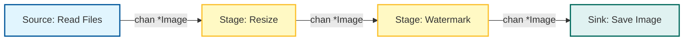

# Lab 04: Image Processing Pipeline

## Goal
Implement concurrent image processing pipeline โดยใช้ Go channels และ goroutines คุณจะได้เปรียบเทียบ performance ระหว่างการทำงานแบบ sequential กับแบบ concurrent "pipeline" architecture

## Architecture

ระบบประกอบด้วย 4 stages ที่เชื่อมต่อกันด้วย channels



## Setup

เริ่มแรกให้ทำการ generate sample input images:
```bash
go run setup_images.go
```
คำสั่งนี้จะสร้าง folder `input/` พร้อมภาพ JPEG 10 ไฟล์

## Tasks

### 1. Run Sequential Version
รัน sequential version ที่เตรียมไว้ให้เพื่อดูเป็น baseline:
```bash
go run sequential/main.go
```
สังเกต execution time (ควรจะใช้เวลาประมาณหนึ่งเนื่องจากมี I/O และ Image Processing จริง)

### 2. Implement Concurrent Version
เปิดไฟล์ `concurrent/main.go` คุณจะเห็นโครงสร้างของ pipeline
หน้าที่ของคุณคือ implement ในส่วนของ stage **Resize** และ **Watermark** และ **Sink** loop

**Requirements:**
1.  **Stage Functions** (`resize`, `watermark`):
    -   ต้องทำงานใน **goroutine** แยกต่างหาก
    -   ต้อง iterate รับค่าจาก input channel
    -   ต้อง process ภาพโดยใช้ฟังก์ชันจาก `utils` ที่เตรียมไว้ให้
    -   ต้องส่ง processed image ไปยัง output channel
    -   ต้อง close output channel เมื่อทำงานเสร็จ
2.  **Sink (Main)**:
    -   ต้อง range over final channel (`watermarkChannel`)
    -   ต้องเรียกใช้ `utils.SaveImage`

### 3. Compare Results
รัน concurrent implementation ของคุณ:
```bash
go run concurrent/main.go
```
เปรียบเทียบ total execution time กับแบบ sequential version
ตรวจสอบ folder `output/` เพื่อให้แน่ใจว่าภาพทั้งหมดถูก process อย่างถูกต้อง
